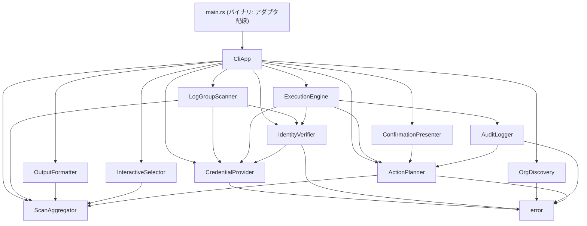
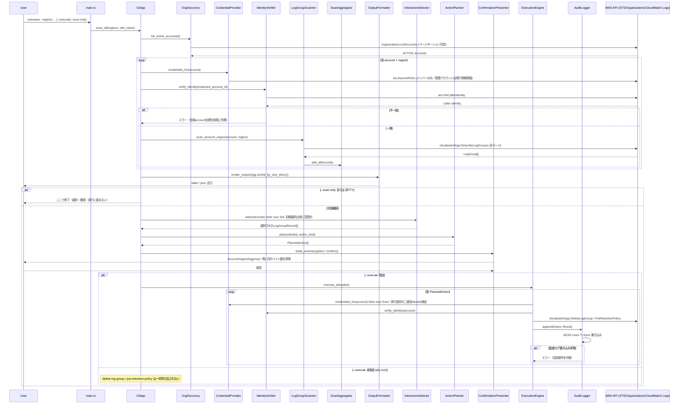

# architecture.md — cwsweep

## Architecture Analysis

### System Overview

`cwsweep` は単一の Cargo パッケージ（バイナリクレート `src/main.rs` ＋
ライブラリクレート `src/lib.rs`）として実装された、AWS 実 API を呼び出す
スタンドアロン CLI である。ライブラリクレートは 12 モジュール＝12 コンポーネントの
構成で、各コンポーネントの外部依存（AWS SDK 呼び出し、対話プロンプト）は全て
トレイト（`async_trait` または同期 trait）で抽象化され、`main.rs` 側の
アダプタ実装（`StsAssumeRoleAdapter` 等）でのみ実 SDK に接続される。これにより
ライブラリ本体はテスト容易性を保ったまま、実行時にはバイナリクレートが
依存を「配線」するという Hexagonal（ports and adapters）に近い構造を取る。

### Architectural Style

**モジュラーモノリス（単一プロセスCLI、レイヤー化＋ポート/アダプタ）** — 根拠:

- デプロイ形態はプロセス分割のないシングルバイナリ（`[[bin]] cwsweep`）であり、
  マイクロサービス的な独立デプロイ単位は存在しない。
- 12 モジュールは `src/lib.rs` の `pub mod` 宣言で並列にエクスポートされ、
  `cli`（`CliApp`）が唯一のオーケストレーションハブとしてほぼ全モジュールに依存する
  一方、`aggregator` と `error` は他モジュールに依存しない葉ノードという明確な
  レイヤー構造を持つ。
- 全ての外部境界（AWS SDK 呼び出し、対話式プロンプト）が trait 経由の
  ports-and-adapters で抽象化されており、`main.rs` がその唯一の compositor である。

### Component Relationships

### Interaction Diagrams

`scan` → 選択 → `clean` の一連のビジネストランザクションが、コンポーネント間で
どう実装されているかを示す（現行の単一コマンドのフロー。サブコマンド分割の
検討点は下記「サブコマンド化に向けた設計上の要点」を参照）。

### Data Flow

1. `OrgDiscovery` → アクティブアカウント一覧（`error` のみに依存する葉に近いモジュール）。
2. `CredentialProvider` → アカウントごとの一時クレデンシャル（`AccountCredentials`、
   `secrecy` でマスキング）。
3. `LogGroupScanner` → `IdentityVerifier` で検証済みクレデンシャルを使い
   `DescribeLogGroups` を全ページ走査し、`LogGroupRecord` を `ScanAggregator` に集約。
4. `ScanAggregator` → 集計済みレコード（`sorted_by_size_desc`、`total_bytes`）を
   `OutputFormatter`・`InteractiveSelector`・`ActionPlanner` の3方向へ供給する
   単一の真実源（single source of truth）。
5. `InteractiveSelector` の選択結果 → `ActionPlanner` が `PlannedAction`
   （`ActionKind::Delete` / `SetRetention{days}`）を生成。
6. `ConfirmationPresenter` が `PlannedAction` を要約・再掲し、ユーザー承認を得る。
7. `ExecutionEngine` が承認済みプランを実行し、各アクションの結果を
   `AuditLogger` へ `Intent`/`Result` の二段階で記録する。

### Key Design Decisions

- **全外部境界の trait 抽象化**: AWS SDK 呼び出し・対話式プロンプトの双方を
  trait（`DescribeLogGroupsOperations`、`ActionApiOperations`、
  `AssumeRoleOperations`、`CallerIdentityOperations`、`ListAccountsOperations`、
  `AuditWrite`、`MultiSelectPrompt`、`ConfirmPrompt` 等）で切り出し、
  ユニットテストでは手書きスタブ/フェイクを直接実装する（外部モックライブラリ不使用）。
  これにより実 AWS API へ触れずに全ロジックをテストできる。
- **二段階 Identity 検証**: スキャン時と実行直前（破壊的操作の直前）の2回、
  独立して `sts:get-caller-identity` を実行する設計（project.md Mandated）。
  スキャン用と実行用で検証関数の命名を分離する方針（team.md Code Style）。
- **dry-run デフォルト＋監査ログ必須**: `--execute` を明示しない限り破壊的操作は
  一切呼ばれず、かつ監査ログの無効化オプション自体を設けない。監査ログ書き込み
  失敗時は当該操作を中断する（警告のみで続行しない）。
- **管理アカウントは AssumeRole しない**: 現行の認証情報をそのまま使い、
  メンバーアカウントに対してのみ AssumeRole する非対称設計。

### Improvement Opportunities

- **CLI 構造のサブコマンド化（本 intent の対象）**: 現状は `Cli` 構造体の
  フラットなフラグ（`--scan-only` / `--execute` が `conflicts_with` で相互排他）
  であり、`main.rs` の `main()` 内フロー分岐（`cli.scan_only` 判定 →
  非TTYフォールバック → 選択/確認/実行）に業務ロジックが集中している。
  `scan` / `clean` サブコマンドへの分割により、この分岐をコマンドの型として
  表現し直せる（詳細は下記）。
- **監査ログの読み取り API 不在**: `AuditLogger`/`AuditWrite` は追記専用であり、
  `audit` 閲覧サブコマンドを新設する場合は読み取り API の追加が必要
  （`code-quality-assessment.md` の技術的負債シグナルも参照）。
- **`action_kind_from_prompt`（`main.rs`）が未テスト**: `inquire::Select` /
  `inquire::CustomType` への直接依存のためユニットテスト対象外。サブコマンド化で
  CLI 引数から直接 `ActionKind` を指定する経路を設ける場合、テスト可能な形へ
  切り出す余地がある。

### サブコマンド化に向けた設計上の要点（本 intent 固有）

- 対象は `src/cli.rs` の `Cli` 構造体（`--regions` 必須、`--execute`/`--scan-only`
  が相互排他）と `src/main.rs` の `main()` 内フロー分岐（`cli.scan_only` 判定 →
  `!std::io::stdin().is_terminal()` によるフォールバック → 対話式選択・確認・実行）。
- 自然な分割は「`scan` サブコマンド＝スキャンのみ」「`clean` サブコマンド＝選択・
  削除フロー、`--execute` で実行/dry-run切替」。既存の `scan_fully_failed` 終了コード
  判定（README.md 記載の CI 向け契約）とdry-run既定を両サブコマンドで維持する
  回帰テストが必要。
- `config` サブコマンドは本 intent のスコープ外。`--role-name` 等の設定系フラグは
  既存フラグのまま各サブコマンドに残す前提。
- `--audit-log-path` は無効化オプションを設けない制約（project.md Mandated）が
  サブコマンド化後も維持されなければならない。
