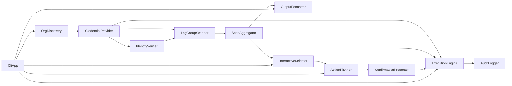

# Domain Design — Component Catalogue

## Part A — Machine-readable Catalogue

```yaml
components:
  - name: CliApp
    summary: clapベースのCLIエントリポイント。サブコマンド解析と全体オーケストレーション
    behaviour: >
      サブコマンド（scan, --output, --execute等）を解析し、他コンポーネントを起動順に呼び出す。
      グローバルフラグ（--role-name, --regions等）を各コンポーネントに引き渡す。
    responsibilities:
      - CLI引数解析
      - コンポーネント呼び出し順序の制御（パイプライン統括）
      - 最終的な終了コード決定
    depends_on:
      - component: OrgDiscovery
        interaction: 対象アカウント一覧を取得する
        style: sync
      - component: OutputFormatter
        interaction: スキャン結果の表示を依頼する
        style: sync
      - component: InteractiveSelector
        interaction: 対話式選択を依頼する
        style: sync
      - component: ActionPlanner
        interaction: 選択結果からアクション計画を作成させる
        style: sync
      - component: ExecutionEngine
        interaction: 実行計画を渡し実行させる
        style: sync
    dependents: []
    external_dependencies:
      - name: clap
        kind: other
        purpose: CLI引数パース
    entities: []

  - name: OrgDiscovery
    summary: Organization内のアクティブアカウントを列挙する
    behaviour: >
      organizations:list-accountsを呼び出し、Status=ACTIVEのアカウントのみ返す。
      管理アカウント自身を含む全アカウントを対象とする。
    responsibilities:
      - アクティブアカウント一覧の取得
    depends_on:
      - component: CredentialProvider
        interaction: アカウント列挙用のクレデンシャルを取得する
        style: sync
    dependents:
      - component: CliApp
        interaction: アカウント一覧を提供する
    external_dependencies:
      - name: AWS Organizations API
        kind: third-party-api
        purpose: list-accounts呼び出し
    entities:
      - name: AccountInfo
        identifier: account_id
        attributes: [account_id, account_name, status]

  - name: CredentialProvider
    summary: アカウントごとの明示的CredentialsProviderを構築する
    behaviour: >
      対象アカウントが管理アカウント自身の場合は現在の認証情報をそのまま使用し、AssumeRoleしない。
      メンバーアカウントの場合はsts:AssumeRoleで一時クレデンシャルを取得する。
      ロール名はCLI引数で指定可能（デフォルトOrganizationAccountAccessRole）。
      環境変数由来の暗黙のクレデンシャルチェーンには一切依存しない。
    responsibilities:
      - アカウントごとの明示的CredentialsProvider構築
      - AssumeRole呼び出し
      - 一時クレデンシャルの非ログ出力保証（Debugマスキング）
    depends_on: []
    dependents:
      - component: OrgDiscovery
        interaction: アカウント一覧取得のためのクレデンシャルを取得する
      - component: IdentityVerifier
        interaction: 検証対象のクレデンシャルを提供される
      - component: LogGroupScanner
        interaction: スキャン用クレデンシャルを提供される
      - component: ExecutionEngine
        interaction: 削除実行用クレデンシャルを提供される
    external_dependencies:
      - name: AWS STS API
        kind: third-party-api
        purpose: AssumeRole呼び出し
    entities:
      - name: AccountCredentials
        identifier: account_id
        attributes: [account_id, access_key_id, secret_access_key, session_token, expiration]

  - name: IdentityVerifier
    summary: API呼び出し直前にsts:get-caller-identityで実アカウントIDを検証する
    behaviour: >
      CredentialProviderが構築したクレデンシャルを使い、期待するアカウントIDと実際に
      sts:get-caller-identityが返すアカウントIDを比較する。不一致の場合は警告のみで
      続行せず、そのアカウントの処理を即座に失敗させる（構造的な取り違え防止）。
      スキャン時点と削除実行直前の二重検証で呼び出される。
    responsibilities:
      - 実アカウントID検証
      - 不一致時の即時失敗
    depends_on:
      - component: CredentialProvider
        interaction: 検証対象のクレデンシャルを取得する
        style: sync
    dependents:
      - component: LogGroupScanner
        interaction: スキャン前の検証を依頼される
      - component: ExecutionEngine
        interaction: 削除直前の二重検証を依頼される
    external_dependencies:
      - name: AWS STS API
        kind: third-party-api
        purpose: get-caller-identity呼び出し
    entities: []

  - name: LogGroupScanner
    summary: describe-log-groupsを全ページ取得してから集計する
    behaviour: >
      各アカウント×各リージョンに対し、describe-log-groupsをページネーターで
      全ページ取得し終えてからメモリ上で集計する独立層。1ページだけ見て
      集計する実装が書けない構造にする（ページネーション完全対応の構造的強制）。
      呼び出し前にIdentityVerifierによる検証を経る。
    responsibilities:
      - CloudWatch Logsロググループの全ページ取得
      - ページ単位ではなく全件確定後の集計
    depends_on:
      - component: CredentialProvider
        interaction: スキャン用クレデンシャルを取得する
        style: sync
      - component: IdentityVerifier
        interaction: スキャン前にアカウントID検証を行う
        style: sync
      - component: ScanAggregator
        interaction: 取得したログループレコードを渡す
        style: sync
    dependents: []
    external_dependencies:
      - name: Amazon CloudWatch Logs API
        kind: third-party-api
        purpose: describe-log-groups呼び出し
    entities: []

  - name: ScanAggregator
    summary: 全アカウント×全リージョンのスキャン結果を保持・集約するモデル
    behaviour: >
      LogGroupScannerから受け取ったログループレコードをアカウントID・リージョンで
      集約し、サイズ降順ソートや合計バイト数計算などの集計ロジックを提供する。
    responsibilities:
      - LogGroupRecordの保持
      - 集計・ソート・合計計算
    depends_on: []
    dependents:
      - component: LogGroupScanner
        interaction: スキャン結果を受け取る
      - component: OutputFormatter
        interaction: 集計済みデータを渡される
      - component: InteractiveSelector
        interaction: 選択候補として渡される
    external_dependencies: []
    entities:
      - name: LogGroupRecord
        identifier: composite(account_id, region, log_group_name)
        attributes: [account_id, region, log_group_name, stored_bytes, retention_in_days]

  - name: OutputFormatter
    summary: スキャン結果のtable/json出力切り替え
    behaviour: >
      ScanAggregatorの集計結果を受け取り、--output table（既定）または
      --output jsonで整形して標準出力に出す。jsonはCursor/Claude Code等の
      CLIエージェントから機械的に読める形式にする。
    responsibilities:
      - table形式の整形出力
      - json形式の整形出力
    depends_on:
      - component: ScanAggregator
        interaction: 集計済みデータを取得する
        style: sync
    dependents:
      - component: CliApp
        interaction: 出力を依頼される
    external_dependencies:
      - name: comfy-table
        kind: other
        purpose: table出力の整形
      - name: serde_json
        kind: other
        purpose: json出力のシリアライズ
    entities: []

  - name: InteractiveSelector
    summary: スキャン結果を対話式マルチセレクトで提示する（初期状態全チェックOFF）
    behaviour: >
      サイズ・retention・アカウントID・リージョンを表示し、チェックボックスで
      複数選択させる。初期状態は必ず全チェックOFFとする（一括全選択のデフォルト禁止）。
      「全選択」操作自体は用意してよいが、明示的に選ばない限り何も選択されない。
    responsibilities:
      - マルチセレクトUIの提示
      - 選択結果の収集
    depends_on:
      - component: ScanAggregator
        interaction: 選択候補一覧を取得する
        style: sync
    dependents:
      - component: CliApp
        interaction: 対話式選択を依頼される
      - component: ActionPlanner
        interaction: 選択結果を渡す
    external_dependencies:
      - name: inquire
        kind: other
        purpose: 対話式マルチセレクトUI
    entities: []

  - name: ActionPlanner
    summary: 選択されたログループと選択アクションから実行計画を構築する
    behaviour: >
      InteractiveSelectorで選択されたログループ群に対し、削除
      （delete-log-group）またはretention設定変更（put-retention-policy）
      のいずれかのアクションを対話的に選択させ、実行計画（PlannedAction一覧）
      を作成する。retention変更の場合は日数の対話入力を受け付ける。
    responsibilities:
      - アクション種別の選択
      - 実行計画（PlannedAction一覧）の構築
    depends_on:
      - component: InteractiveSelector
        interaction: 選択されたログループ一覧を取得する
        style: sync
    dependents:
      - component: CliApp
        interaction: 実行計画作成を依頼される
      - component: ConfirmationPresenter
        interaction: 実行計画を渡す
    external_dependencies:
      - name: inquire
        kind: other
        purpose: アクション種別・retention日数の対話入力
    entities:
      - name: PlannedAction
        identifier: composite(account_id, region, log_group_name, action_kind)
        attributes: [account_id, region, log_group_name, action_kind, retention_days, confirmed]
        references:
          - entity: LogGroupRecord
            owned_by: ScanAggregator
            relationship: 各PlannedActionは1つのLogGroupRecordに対する操作である

  - name: ConfirmationPresenter
    summary: 実行前確認画面を表示する
    behaviour: >
      対象アカウントID・リージョン・ログループ名一覧・合計バイト数を再掲し、
      最終確認を取る。確認が得られない限りExecutionEngineは呼ばれない。
      ConfirmationPresenterはActionPlanner所有のPlannedActionを直接ミューテートしない。
      確認結果（confirmed=true）を反映した確認済みコピーを生成してExecutionEngineへ渡す。
      元のPlannedAction（ActionPlanner所有）はconfirmed未設定のまま不変とする。
    responsibilities:
      - 実行計画の再掲
      - 最終確認の取得
    depends_on:
      - component: ActionPlanner
        interaction: 実行計画を取得する
        style: sync
    dependents:
      - component: CliApp
        interaction: 確認結果を依頼される
      - component: ExecutionEngine
        interaction: 確認済み実行計画を渡す
    external_dependencies:
      - name: inquire
        kind: other
        purpose: 最終確認プロンプト
    entities: []

  - name: ExecutionEngine
    summary: dry-run既定、--execute時のみ書き込みAPIを呼び出す実行エンジン
    behaviour: >
      明示的に--executeフラグを渡さない限り削除・変更APIは呼ばれず、何を消す予定かの
      一覧表示のみで終わる（dry-runデフォルト）。--execute時は、各PlannedActionの
      実行直前にIdentityVerifierへ再検証を依頼する（削除直前の二重Identity検証）。
      検証通過後、delete-log-groupまたはput-retention-policyを呼び出す。
    responsibilities:
      - dry-run表示ロジック
      - --execute時の実削除・retention変更実行
      - 削除直前の二重Identity検証の呼び出し
    depends_on:
      - component: ConfirmationPresenter
        interaction: 確認済み実行計画を取得する
        style: sync
      - component: IdentityVerifier
        interaction: 削除直前に再検証する
        style: sync
      - component: CredentialProvider
        interaction: 実行用クレデンシャルを取得する
        style: sync
      - component: AuditLogger
        interaction: 実行結果を渡し記録させる
        style: sync
    dependents:
      - component: CliApp
        interaction: 実行結果を返す
    external_dependencies:
      - name: Amazon CloudWatch Logs API
        kind: third-party-api
        purpose: delete-log-group / put-retention-policy呼び出し
    entities: []

  - name: AuditLogger
    summary: 実行結果の監査ログを必須出力する
    behaviour: >
      対象アカウントID・リージョン・ログループ名・実行時刻・成功/失敗を必ず
      ファイルに記録する（無効化オプションなし）。監査ログの書き込みに失敗した
      場合は、実行中の削除/retention変更操作自体を中断し、エラーとして扱う。
    responsibilities:
      - 監査ログの必須ファイル出力
      - 書き込み失敗時の操作中断
    depends_on: []
    dependents:
      - component: ExecutionEngine
        interaction: 実行結果を記録される
    external_dependencies:
      - name: ローカルファイルシステム
        kind: other
        purpose: 監査ログファイルの書き込み
    entities:
      - name: AuditEntry
        identifier: composite(timestamp, account_id, region, log_group_name)
        attributes: [timestamp, account_id, region, log_group_name, action_kind, success, error_message]
```

## Part B — Human-readable View

### Component Diagram



（テキストフォールバック: CliApp起点でOrgDiscovery→CredentialProvider→IdentityVerifier→LogGroupScanner→ScanAggregator→OutputFormatter/InteractiveSelector→ActionPlanner→ConfirmationPresenter→ExecutionEngine（IdentityVerifier/CredentialProviderを再利用）→AuditLoggerの一方向パイプライン。）

### Component Summary

| Component | Purpose | Depends On | Dependents | Entities Owned |
|---|---|---|---|---|
| CliApp | CLIエントリポイント・オーケストレーション | OrgDiscovery, OutputFormatter, InteractiveSelector, ActionPlanner, ExecutionEngine | — | — |
| OrgDiscovery | アカウント列挙 | — | CliApp, CredentialProvider | AccountInfo |
| CredentialProvider | クレデンシャル構築・AssumeRole | — | OrgDiscovery, IdentityVerifier, LogGroupScanner, ExecutionEngine | AccountCredentials |
| IdentityVerifier | Identity検証 | CredentialProvider | LogGroupScanner, ExecutionEngine | — |
| LogGroupScanner | 全ページ取得・集計 | CredentialProvider, IdentityVerifier | ScanAggregator | — |
| ScanAggregator | 集計結果の保持 | — | LogGroupScanner, OutputFormatter, InteractiveSelector | LogGroupRecord |
| OutputFormatter | table/json出力 | ScanAggregator | CliApp | — |
| InteractiveSelector | マルチセレクトUI | ScanAggregator | CliApp, ActionPlanner | — |
| ActionPlanner | 実行計画構築 | InteractiveSelector | CliApp, ConfirmationPresenter | PlannedAction |
| ConfirmationPresenter | 実行前確認画面 | ActionPlanner | CliApp, ExecutionEngine | — |
| ExecutionEngine | dry-run/実削除実行 | ConfirmationPresenter, IdentityVerifier, CredentialProvider | CliApp, AuditLogger | — |
| AuditLogger | 監査ログ出力 | — | ExecutionEngine | AuditEntry |

### Entity Ownership

| Entity | Owning Component | Identifier | Attributes | References |
|---|---|---|---|---|
| AccountInfo | OrgDiscovery | account_id | account_id, account_name, status | — |
| AccountCredentials | CredentialProvider | account_id | account_id, access_key_id, secret_access_key, session_token, expiration | — |
| LogGroupRecord | ScanAggregator | composite(account_id, region, log_group_name) | account_id, region, log_group_name, stored_bytes, retention_in_days | — |
| PlannedAction | ActionPlanner | composite(account_id, region, log_group_name, action_kind) | account_id, region, log_group_name, action_kind, retention_days, confirmed | LogGroupRecord (ScanAggregator) |
| AuditEntry | AuditLogger | composite(timestamp, account_id, region, log_group_name) | timestamp, account_id, region, log_group_name, action_kind, success, error_message | — |

### External Dependencies

| Component | Dependency | Kind | Purpose |
|---|---|---|---|
| OrgDiscovery | AWS Organizations API | third-party-api | list-accounts呼び出し |
| CredentialProvider | AWS STS API | third-party-api | AssumeRole呼び出し |
| IdentityVerifier | AWS STS API | third-party-api | get-caller-identity呼び出し |
| LogGroupScanner | Amazon CloudWatch Logs API | third-party-api | describe-log-groups呼び出し |
| ExecutionEngine | Amazon CloudWatch Logs API | third-party-api | delete-log-group / put-retention-policy呼び出し |
| AuditLogger | ローカルファイルシステム | other | 監査ログファイルの書き込み |
| CliApp | clap | other | CLI引数パース |
| OutputFormatter | comfy-table, serde_json | other | table/json出力整形 |
| InteractiveSelector, ActionPlanner, ConfirmationPresenter | inquire | other | 対話式UI |

### Rationale

| Component | 分離理由 |
|---|---|
| CredentialProvider / IdentityVerifier | 認証情報取り違え事故（PRD背景）の再発防止のため、クレデンシャル構築と検証を独立コンポーネントとして分離し、他コンポーネントから暗黙の環境変数チェーンに依存させない構造にする |
| LogGroupScanner / ScanAggregator | ページネーション未対応事故（PRD背景）の再発防止のため、全ページ取得の完了を保証する層（LogGroupScanner）と、確定後の集計ロジック（ScanAggregator）を分離し、「1ページだけ見て集計する」実装が構造的に書けないようにする |
| ActionPlanner / ConfirmationPresenter / ExecutionEngine | 誤削除防止のため、計画（何をするか）・確認（本当にするか）・実行（実際にする）を明確に3層へ分離し、確認を経ずに実行に到達できない構造にする |
| AuditLogger | 監査ログが「無効化オプションなし」の必須要件であるため、実行結果記録を独立コンポーネントとし、実行操作自体（ExecutionEngine）から責務を分離する |

#### Component-boundary options（複数案の検討）

単一案（LogGroupScannerとScanAggregatorを1コンポーネントに統合する案）も検討したが、ページネーション完全対応というPRDの構造的要件（「1ページだけ見て集計する実装が書けない設計」）を明確にコード構造へ落とし込むため、取得層と集計層を分離する案を採用した。

- Option A（採用）— 分離: 全ページ取得の完了とメモリ上集計を別コンポーネントにする。Pros: 「未完了ページで集計させない」制約が型・呼び出し順序で強制できる。Cons: コンポーネント数が1つ増える。可逆性: 高（後で統合も容易）。
- Option B（却下）— 統合: 1コンポーネントでページ取得と集計を両方担う。Pros: シンプル。Cons: 実装者が誤って途中集計してしまう余地が構造的に残る（PRD背景の事故の再発防止にならない）。
- Recommendation: Option A。ページネーション事故の再発防止という非機能要件を構造で担保するため。

## Assumptions & Open Questions

None.
