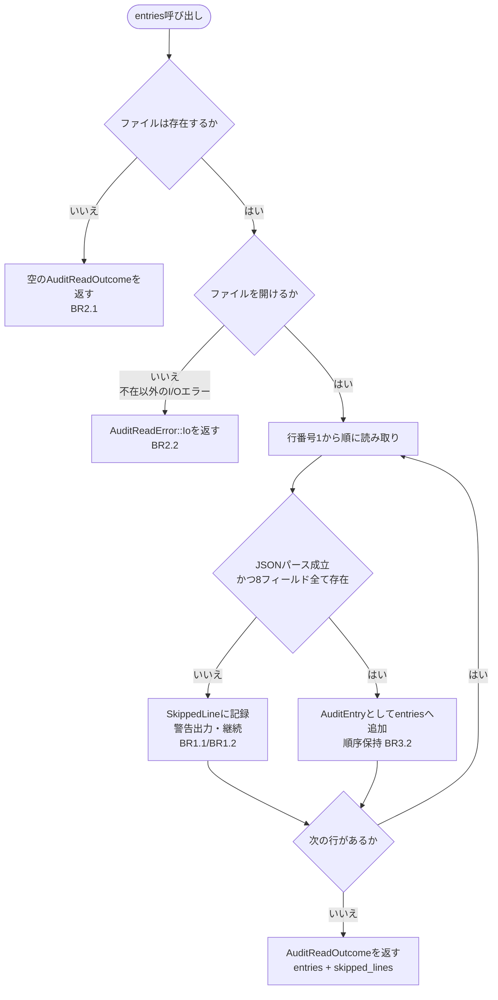
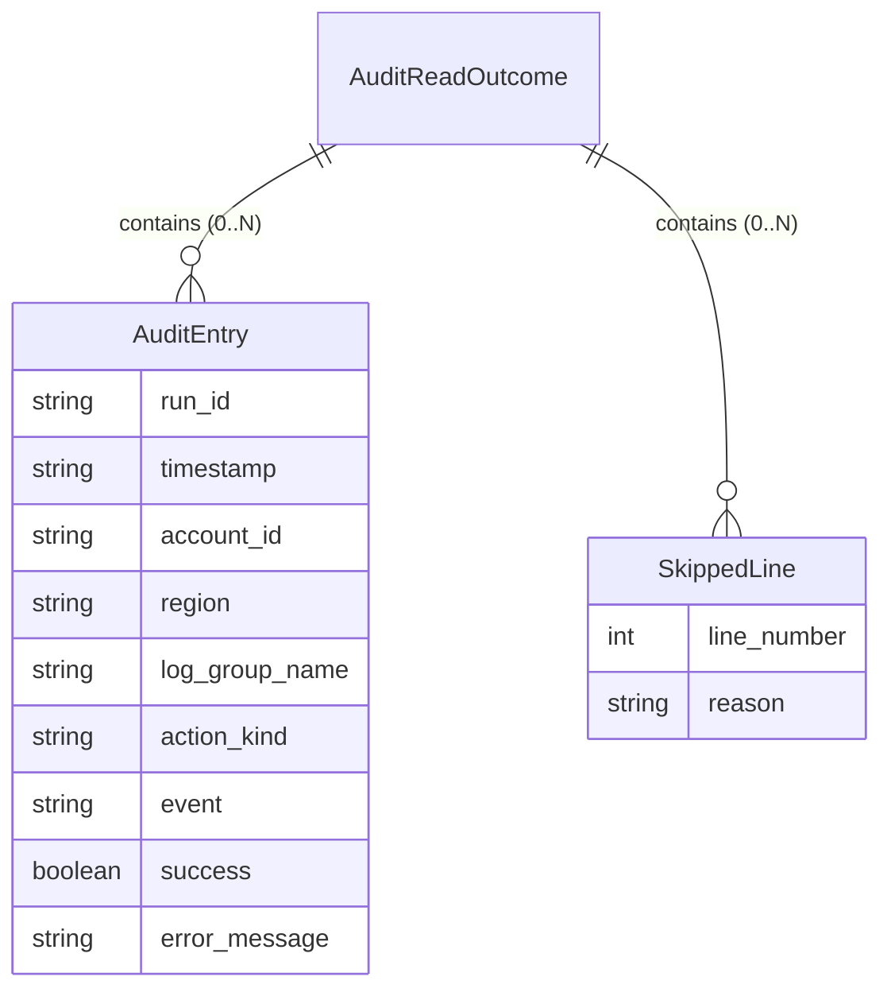

# functional-spec.md — Unit: audit-reader

技術非依存の振る舞い仕様。`AuditRead`（`AuditReader`実装）が監査ログを
読み取って `AuditReadOutcome` を返すまでのワークフローと、ステップ順序・
異常系分岐を規定する。データ形状（entities.md）と決定ロジック（rules.md）
は本ファイルの対象外であり、ここでは「どの順序で何が起きるか」のみを
定める。

## ワークフロー: 監査ログ読み取り（`AuditRead::entries()`）

1. **ファイル存在確認**: 設定された監査ログパス（既定 `cwsweep-audit.jsonl`、
   `--audit-log-path` で上書き可能）にファイルが存在するか確認する。
   - 存在しない場合 → ステップ2（BR2.1）で終了する。
2. **ファイル不在の正常終了**: `entries: []`, `skipped_lines: []` の
   `AuditReadOutcome` を返し、成功として終了する（BR2.1）。ここで
   ワークフローは終わる。
3. **ファイルを開く**: ファイルが存在する場合、読み取り用に開く。
   - ファイル不在以外の理由（権限不足等）で開けない、または読み取り自体
     が失敗する場合 → `AuditReadError::Io` を返して終了する（BR2.2）。
     行単位の処理には進まない。
4. **行単位の読み取りループ**: ファイルの先頭から1行ずつ、行番号1から
   順に処理する（ストリーミング）。各行について:
   1. その行をJSONとしてパースし、`AuditEntry` の8個の必須フィールド
      （`run_id` / `timestamp` / `account_id` / `region` /
      `log_group_name` / `action_kind` / `event` / `success`）がすべて
      揃っているか検証する（BR1.2）。
   2. パースに失敗した、または必須フィールドが1つでも欠けている場合
      → その行を `SkippedLine`（行番号・理由）として記録し、理由付きの
      警告を標準エラーへ出力し、次の行へ進む（BR1.1）。この行は
      `entries` に加えない。
   3. 検証に成功した場合 → `AuditEntry` を構築し、`entries` の末尾に
      追加する（BR3.2: 出現順を保持する）。
   4. 次の行があれば4-1へ戻る。ファイル末尾に達したらステップ5へ進む。
5. **結果の返却**: これまでに収集した `entries`（出現順）と
   `skipped_lines`（出現順）を保持する `AuditReadOutcome` を構築し、
   呼び出し元（`cli-foundation` の `run_audit` ハンドラ）へ返す。
   `AuditReader` はこの間、ファイルへの書き込みを一切行わない（BR4.1）。

## 呼び出し元での表示ワークフロー（`run_audit` ハンドラ、参考）

本Unitの責務範囲外だが、`AuditReadOutcome` がどう使われるかの文脈として
記載する（実装は `cli-foundation` Unitが担う）。

1. `run_audit` が `AuditRead::entries()` を呼び出し、`AuditReadOutcome`
   を受け取る。
2. `entries` を `OutputFormatter` へそのまま渡す。`event`（intent/result）
   による絞り込みは行わない（BR5.1）。対応するresult行がないintent行も
   他の行と同じ形式でそのまま整形対象とする（BR5.2）。
3. `--output table|json` に応じて `OutputFormatter` が整形し、標準出力へ
   表示する。
4. `skipped_lines` に対応する警告は、読み取り中（ステップ4-2）に
   `AuditReader` 自身が標準エラーへ既に出力済みであり、`run_audit` は
   これを再度出力する責務を持たない。

## データモデル（entities.mdからの派生ビュー）

## ルールサマリー（rules.mdからの派生ビュー）

| ID | 概要 |
|---|---|
| BR1.1 | 不正行はスキップ+警告し、処理を継続する |
| BR1.2 | 8フィールド全て揃った行のみ有効なAuditEntry |
| BR2.1 | ファイル不在は空の正常結果として扱う |
| BR2.2 | ファイル不在以外のI/OエラーはAuditReadError::Io |
| BR3.1 | 絞り込み機能は持たない（初回実装） |
| BR3.2 | 記録順を保持する |
| BR4.1 | 書き込み・ファイル作成を一切行わない |
| BR4.2 | ExecutionEngine/AuditWriteへの依存を型レベルで排除 |
| BR5.1 | intent/result両方を全件表示 |
| BR5.2 | 未完了操作を特別扱いしない |
