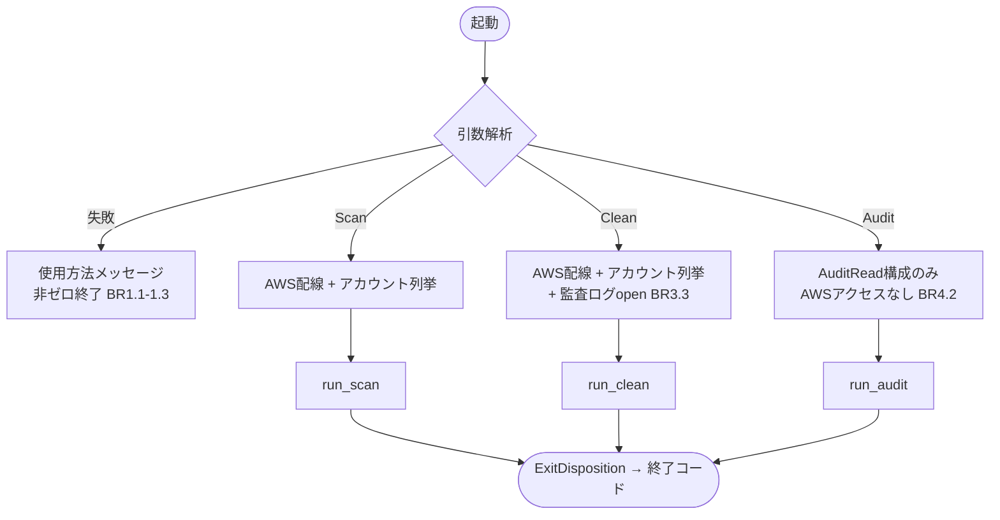
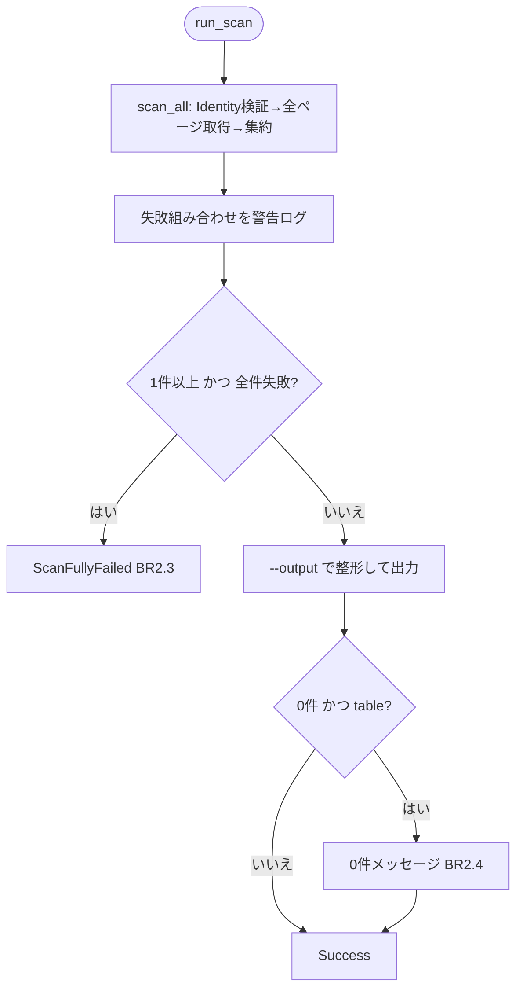
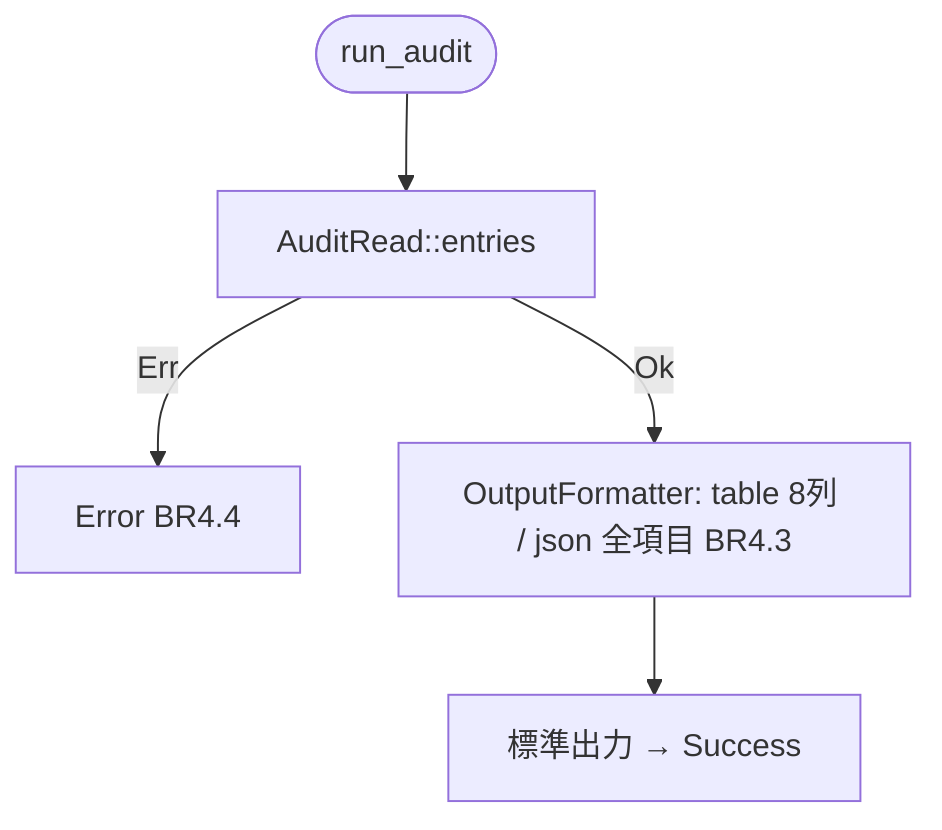
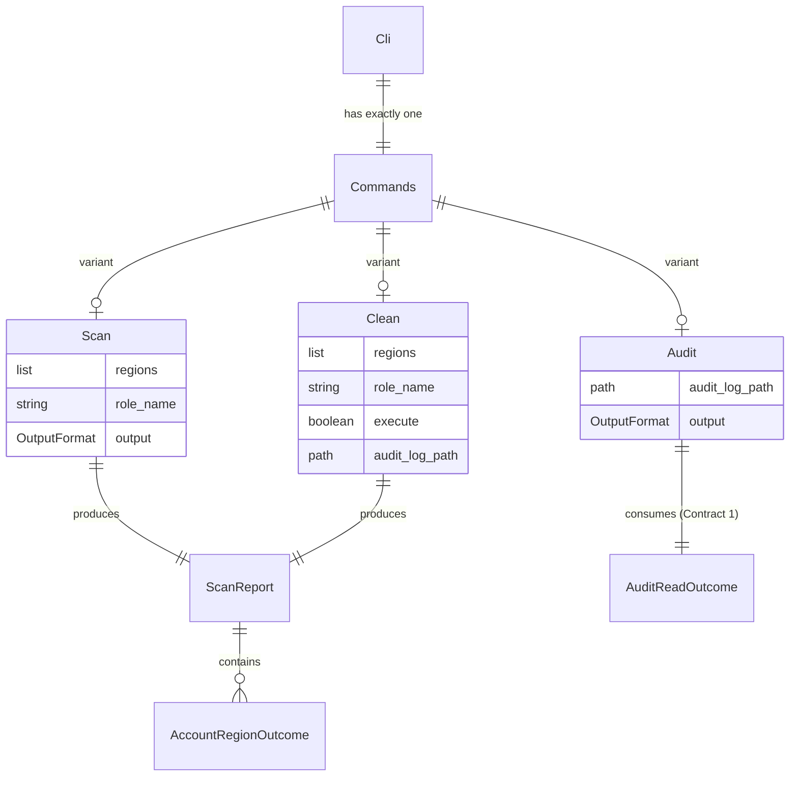

# functional-spec.md — Unit: cli-foundation

技術非依存の振る舞い仕様。`cwsweep` の起動からサブコマンド別ハンドラ
（`run_scan` / `run_clean` / `run_audit`）が終了方針を返すまでのワークフローを
規定する。データ形状は `entities.md`、決定ロジックは `rules.md` を参照。

## ワークフロー0: 引数解析とディスパッチ

1. **引数解析**: コマンドライン全体を `Cli` として解析する。
   - サブコマンド未指定・未知のサブコマンド・所属しないオプション・
     `--regions` 欠落は、いずれも使用方法メッセージを標準エラーへ出力して
     コマンドライン誤用の終了コードで終了する（BR1.1 / BR1.2 / BR1.3）。
     旧フラグ形式（`cwsweep --regions ... --execute`、`--scan-only`）も
     この経路に落ちる（BR6.2）。
2. **サブコマンド別の依存構成（main の責務）**: `Commands` のバリアントに
   応じて、必要な実アダプタのみを実体化する（BR6.1）。
   - `Scan` / `Clean`: AWS 認証情報の解決 → 管理アカウント Identity 取得 →
     Organization アカウント列挙（非メンバーなら単一アカウントモード）。
     `Clean` のみ監査ログ出力先をオープンする（BR3.3）。オープン失敗は
     即時エラー終了。
   - `Audit`: AWS へ一切アクセスせず、`--audit-log-path` から `AuditRead`
     実装を構成するのみ（BR4.2）。
3. **ディスパッチ**: バリアントに対応するハンドラを呼び出し、返された
   `ExitDisposition` をプロセス終了コードへ写像する
   （`Success`→0、`ScanFullyFailed` / `Error`→非ゼロ＋メッセージ）。



## ワークフロー1: `run_scan`（FR2）

1. **スキャン**: アカウント一覧 × リージョン一覧を走査し、各組み合わせで
   Identity 検証 → describe-log-groups 全ページ取得 → 集約を行う
   （BR5.1）。1組み合わせの失敗は他を止めず `AccountRegionOutcome::Failed`
   として保持する。
2. **失敗の報告**: 失敗した組み合わせごとに警告ログを出力する。
3. **全滅判定**: 対象が1件以上あり全件失敗なら `ScanFullyFailed` を返して
   終了する（BR2.3）。
4. **出力**: 集約結果を `--output` に応じて整形し標準出力へ書く。
5. **0件メッセージ**: 集約が空かつ `table` のときのみ棚卸し文脈の
   0件メッセージを追記する（BR2.4）。
6. **終了**: `Success` を返す。対話式選択・確認・実行には進まない
   （BR2.1）。監査ログには何も書かない（BR2.2）。



## ワークフロー2: `run_clean`（FR3）

1. **スキャン・報告・全滅判定**: ワークフロー1のステップ1〜3と同一
   （共通処理を再利用する）。
2. **スキャン結果表示**: table 形式で表示する（`clean` は `--output` を
   持たない、BR1.2）。
3. **0件終了**: 集約が空なら「削除対象なし」を表示して `Success`。
4. **非TTY判定**: 標準入力が TTY でなければ、対話式選択に進めない旨と
   `scan` の利用案内を警告して `Success`（BR3.4）。
5. **対話式選択**: サイズ降順の候補を初期状態すべて OFF で提示する。
   選択0件なら「選択なし」を表示して `Success`。
6. **アクション種別選択とプラン生成**: 削除 / retention 変更を選び、
   `PlannedAction` 一覧を生成する。
7. **確認**: 実行モード（`--execute` の有無で DRY-RUN / 実行）を明示した
   確認画面を提示する。否なら「中止」を表示して `Success`。
8. **実行**: 確認済みアクションを実行フェーズへ渡す。`--execute` が無ければ
   すべて dry-run として記録され API は呼ばれない（BR3.2）。実行直前の
   二重目 Identity 検証と監査ログ（intent / result）の記録は既存機構に
   従う（BR5.1 / BR3.3）。
9. **結果表示・終了**: アクションごとの結果行を表示し `Success`。
   実行フェーズ自体の失敗は `Error`。

```mermaid
flowchart TD
    C([run_clean]) --> Scan[スキャン・警告・全滅判定<br/>（run_scanと共通）]
    Scan -->|全滅| Fail[ScanFullyFailed]
    Scan --> Show[table表示]
    Show --> Empty{0件?}
    Empty -->|はい| NoTarget[削除対象なし → Success]
    Empty -->|いいえ| Tty{stdinはTTY?}
    Tty -->|いいえ| NonTty[警告: scanを案内 → Success BR3.4]
    Tty -->|はい| Select[対話式選択 全OFF初期]
    Select -->|0件| NoSel[選択なし → Success]
    Select --> Kind[アクション種別選択 → plan]
    Kind --> Confirm{確認 (DRY-RUN/実行を明示)}
    Confirm -->|否| Abort[中止 → Success]
    Confirm -->|承認| Exec[execute (二重Identity検証・監査記録)<br/>--execute なしはdry-run BR3.2]
    Exec --> Lines[結果行表示 → Success]
```

## ワークフロー3: `run_audit`（FR4）

1. **読み取り**: `AuditRead::entries()` を呼び出す（BR4.1）。
   - `Err(AuditReadError)` の場合 → `Error` を返して終了（BR4.4）。
   - ファイル不在は audit-reader 側で空結果として返るため、0件表示で
     正常終了となる。
2. **整形**: `entries` を絞り込みなしで `OutputFormatter` へ渡し、
   `--output` に応じて table（8列、intent 行の success は `-`）または
   json（全9フィールドの配列）を生成する（BR4.3）。
3. **出力・終了**: 標準出力へ書き、`Success` を返す。`skipped_lines` の
   警告は再出力しない（BR4.4）。AWS API・監査ログ書き込みには到達しない
   （BR4.2）。



## 状態遷移（clean の実行モード）

`clean` は `--execute` の有無で2状態のみを持ち、実行中に遷移しない。

| 状態 | 入口 | API 呼び出し | 監査ログ |
|---|---|---|---|
| DRY-RUN（既定） | `--execute` なし | なし（全アクション skipped） | intent / result を記録 |
| EXECUTE | `--execute` あり | 確認承認後のみ delete / put-retention | intent / result を記録 |

## データモデル（entities.md からの派生ビュー）



## ルールサマリー（rules.md からの派生ビュー）

| ID | 概要 |
|---|---|
| BR1.1 | サブコマンド未指定はパースエラー、後方互換なし |
| BR1.2 | オプションは所属サブコマンドでのみ受理 |
| BR1.3 | --regions 必須・重複除去・フォールバックなし |
| BR2.1 | scan は表示のみ |
| BR2.2 | scan は監査ログへ書き込まない |
| BR2.3 | R-03 終了コード方針を維持 |
| BR2.4 | scan 0件時の出力方針 |
| BR3.1 | clean は既存デフォルトフロー |
| BR3.2 | --execute なしでは API を呼ばない |
| BR3.3 | clean は監査ログ必須 |
| BR3.4 | 非TTY の clean は警告して正常終了 |
| BR4.1 | audit は全件表示 |
| BR4.2 | run_audit の依存は AuditRead と OutputFormatter のみ |
| BR4.3 | audit の table 8列 / json 全9フィールド |
| BR4.4 | 警告再出力なし、読み取り失敗はエラー |
| BR5.1 | 既存安全機構を維持 |
| BR6.1 | ロジックは lib 側 |
| BR6.2 | 旧フラグの後方互換シムなし |
