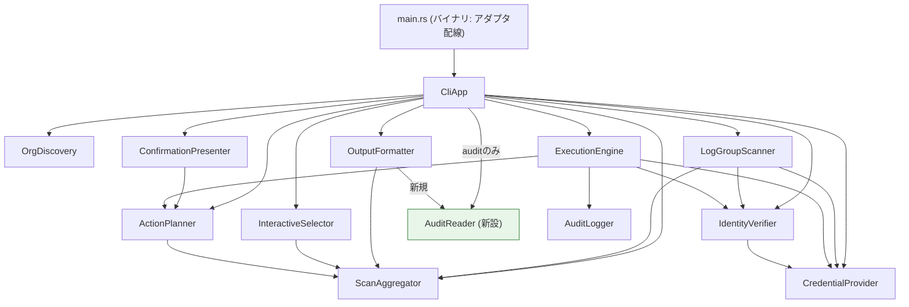

# components.md — CLIサブコマンド化 (260917-cli-subcommands)

既存13モジュール(12コンポーネント＋横断的な`error`)のうち、本intentで変更が生じるのは
`CliApp`(オーケストレーション責務の再編)と`AuditLogger`(読み取り専用コンポーネント
`AuditReader`の追加)のみ。それ以外の10コンポーネントは責務・依存関係とも変更なし
（`architecture.md`/`component-inventory.md`を参照）。

## Part A — コンポーネントカタログ（機械可読）

```yaml
components:
  - name: CliApp
    summary: CLI引数解析(clap `Cli`/`Commands`)とサブコマンド別オーケストレーション
    behaviour: >
      サブコマンド(scan/clean/audit)ごとに1つのハンドラメソッド(run_scan/run_clean/
      run_audit、`run_`接頭辞は本intentのCode Style確定事項)を持つ。各ハンドラは
      自分が必要とするコンポーネントのみを呼ぶ: run_scanはScanner/Aggregator/Output
      のみ、run_cleanは既存のscan_all→select→plan→confirm→executeの全経路、
      run_auditはAuditReader/Outputのみで、破壊的操作系コンポーネント(ExecutionEngine/
      AuditLogger)には一切依存しない。サブコマンド判定・ディスパッチロジック自体は
      lib側(このコンポーネント)に置き、main.rsは薄い呼び出しのみに留める
      （practices-discovery Q3で確定済みの構造要件）。
    responsibilities:
      - CLI引数解析(Cli構造体・Commands enum、clap)
      - サブコマンドごとのオーケストレーション呼び出し順序の決定
      - 終了コード判定(scan_fully_failed、R-03契約の維持)
    depends_on:
      - component: OrgDiscovery
        interaction: アクティブアカウント一覧の取得(scan/clean共通)
        style: sync
      - component: LogGroupScanner
        interaction: 各アカウント×リージョンのロググループ棚卸し(scan/clean共通)
        style: sync
      - component: ScanAggregator
        interaction: スキャン結果の集約(scan/clean共通)
        style: sync
      - component: OutputFormatter
        interaction: スキャン結果(scan/clean)および監査ログ内容(audit)の出力整形
        style: sync
      - component: InteractiveSelector
        interaction: 対話式マルチセレクト(cleanのみ)
        style: sync
      - component: ActionPlanner
        interaction: PlannedAction生成(cleanのみ)
        style: sync
      - component: ConfirmationPresenter
        interaction: 実行前確認画面の提示(cleanのみ)
        style: sync
      - component: ExecutionEngine
        interaction: 削除・retention変更の実行(cleanのみ、--execute時)
        style: sync
      - component: CredentialProvider
        interaction: アカウントごとの一時クレデンシャル取得(scan/clean共通)
        style: sync
      - component: IdentityVerifier
        interaction: Identity二重検証(scan/clean共通)
        style: sync
      - component: AuditReader
        interaction: 監査ログの読み取り専用表示(auditのみ)
        style: sync
    dependents: []
    entities:
      - name: Commands
        identifier: enumバリアント名(Scan|Clean|Audit)
        attributes: [regions, role_name, output, execute, audit_log_path]
        references: []

  - name: LogGroupScanner
    summary: CloudWatch Logs describe-log-groupsのページネーション完走スキャン
    behaviour: >
      変更なし（architecture.md/component-inventory.md参照）。
    responsibilities:
      - describe-log-groupsの全ページ走査
    depends_on:
      - component: ScanAggregator
        interaction: LogGroupRecord生成
        style: sync
      - component: CredentialProvider
        interaction: スキャン用クレデンシャル取得
        style: sync
      - component: IdentityVerifier
        interaction: スキャン時Identity検証
        style: sync
    dependents:
      - component: CliApp
        interaction: scan/clean双方から呼ばれる
    entities: []

  - name: ScanAggregator
    summary: スキャン結果の集約・集計（単一の真実源）
    behaviour: >
      変更なし。
    responsibilities:
      - LogGroupRecordの集約・サイズ降順ソート・合計バイト数集計
    depends_on: []
    dependents:
      - component: CliApp
        interaction: 集約結果の取得
      - component: LogGroupScanner
        interaction: レコード追加
      - component: OutputFormatter
        interaction: 出力整形の入力
      - component: InteractiveSelector
        interaction: 選択対象の入力
      - component: ActionPlanner
        interaction: プラン生成の入力
    entities:
      - name: LogGroupRecord
        identifier: "(account_id, region, log_group_name)の組"
        attributes: [account_id, region, log_group_name, stored_bytes, retention_in_days]
        references: []

  - name: InteractiveSelector
    summary: 対話式マルチセレクト(初期選択は常に空配列)
    behaviour: >
      変更なし。cleanサブコマンドのみが使用する。
    responsibilities:
      - 削除/retention変更対象ロググループのユーザー選択
    depends_on:
      - component: ScanAggregator
        interaction: 選択肢の取得
        style: sync
    dependents:
      - component: CliApp
        interaction: cleanハンドラから呼ばれる
    entities: []

  - name: ActionPlanner
    summary: 選択済みレコードからPlannedActionを構築
    behaviour: >
      変更なし。cleanサブコマンドのみが使用する。
    responsibilities:
      - ActionKind::Delete / SetRetention{days}のPlannedAction構築
      - retention許容値の検証
    depends_on:
      - component: ScanAggregator
        interaction: LogGroupRecordからの構築
        style: sync
    dependents:
      - component: CliApp
        interaction: cleanハンドラから呼ばれる
      - component: ConfirmationPresenter
        interaction: 確認画面の入力
      - component: ExecutionEngine
        interaction: 実行対象の入力
    entities:
      - name: PlannedAction
        identifier: "(account_id, region, log_group_name, action_kind)の組"
        attributes: [account_id, region, log_group_name, action_kind, confirmed]
        references: []

  - name: ConfirmationPresenter
    summary: 実行前確認画面の提示
    behaviour: >
      変更なし。cleanサブコマンドのみが使用する。
    responsibilities:
      - 対象アカウントID・リージョン・ログループ名一覧・合計バイト数の再掲提示
    depends_on:
      - component: ActionPlanner
        interaction: PlannedActionの要約
        style: sync
    dependents:
      - component: CliApp
        interaction: cleanハンドラから呼ばれる
    entities: []

  - name: ExecutionEngine
    summary: delete-log-group / put-retention-policyの実行
    behaviour: >
      変更なし。cleanサブコマンドの--execute時のみ使用する。AuditReaderからは
      到達不能（project.md Forbidden: audit経路からの構造的分離）。
    responsibilities:
      - 実行直前の二重目Identity検証
      - 削除・retention変更APIの呼び出し
    depends_on:
      - component: AuditLogger
        interaction: Intent/Resultの二段階監査記録
        style: sync
      - component: CredentialProvider
        interaction: 実行用クレデンシャル取得
        style: sync
      - component: IdentityVerifier
        interaction: 実行直前の二重目Identity検証
        style: sync
      - component: ActionPlanner
        interaction: 実行対象の取得
        style: sync
    dependents:
      - component: CliApp
        interaction: cleanハンドラの--execute時のみ呼ばれる
    entities: []

  - name: CredentialProvider
    summary: AssumeRoleによる一時クレデンシャル取得
    behaviour: >
      変更なし。
    responsibilities:
      - メンバーアカウントへのAssumeRole(管理アカウントは現行クレデンシャル使用)
    depends_on: []
    dependents:
      - component: CliApp
      - component: LogGroupScanner
      - component: IdentityVerifier
      - component: ExecutionEngine
    entities:
      - name: AccountCredentials
        identifier: account_id
        attributes: [account_id, access_key_id, secret_access_key, session_token, expiration]
        references: []

  - name: IdentityVerifier
    summary: sts:get-caller-identityによるアカウントID一致検証
    behaviour: >
      変更なし。スキャン時・実行直前の二重検証を維持。
    responsibilities:
      - 期待アカウントIDとの一致検証、不一致時の即時失敗
    depends_on:
      - component: CredentialProvider
        interaction: 検証用クレデンシャルの参照
        style: sync
    dependents:
      - component: CliApp
      - component: LogGroupScanner
      - component: ExecutionEngine
    entities: []

  - name: OrgDiscovery
    summary: Organizations list-accountsのページネーション完走取得
    behaviour: >
      変更なし。
    responsibilities:
      - ACTIVEアカウント一覧の取得
    depends_on: []
    dependents:
      - component: CliApp
        interaction: scan/clean双方から呼ばれる
    entities:
      - name: AccountInfo
        identifier: account_id
        attributes: [account_id, account_name, status]
        references: []

  - name: AuditLogger
    summary: 監査ログの追記専用記録（Intent/Resultの二段階、JSON Lines・fsync）
    behaviour: >
      振る舞いは変更なし。無効化オプションを設けない。書き込み失敗時は当該操作を
      中断させる契約を維持する。同一ファイル(src/audit.rs)内に、本intentで新設する
      AuditReader（読み取り専用、下記）と型レベルで完全に分離した状態で共存する
      （domain-design Q2で「同一ファイル・型レベル分離」を確定）。
    responsibilities:
      - 削除・retention変更操作のIntent/Result記録
    depends_on:
      - component: ActionPlanner
        interaction: ActionKindを監査エントリに埋め込む
        style: sync
    dependents:
      - component: ExecutionEngine
        interaction: 実行結果の記録
    entities: []

  - name: AuditReader
    summary: 監査ログ(JSON Lines)の読み取り専用パーサ・アクセサ（本intentで新設）
    behaviour: >
      auditサブコマンド専用の新設コンポーネント。削除・retention変更API、および
      監査ログ書き込み系(AuditLogger/AuditWrite)への依存を一切持たない
      （project.md Forbidden、コンパイル時点で到達不能な依存グラフとする構造的
      強制）。監査ログファイルを行単位でストリーミング読み取りし、不正フォーマット
      行はスキップして警告し、残りの正常な行の読み取りを継続する
      （practices-discovery Q7の確定事項）。対象ファイルが存在しない場合は空扱いで
      正常終了する。
    responsibilities:
      - 監査ログ(JSON Lines)の読み取り・パース
      - 不正フォーマット行のスキップ+警告
      - AuditEntryの列挙
    depends_on: []
    dependents:
      - component: CliApp
        interaction: auditハンドラから呼ばれる
    entities:
      - name: AuditEntry
        identifier: "(timestamp, account_id, region, log_group_name)の組（一意性は監査ログの記録順序で担保、厳密なユニーク制約はない）"
        attributes: [timestamp, account_id, region, log_group_name, action, result]
        references: []

  - name: OutputFormatter
    summary: table/JSON出力切り替え
    behaviour: >
      本intentで対象データを拡張する: 従来のScanAggregator由来の出力
      （scan/clean共通）に加え、AuditReader由来のAuditEntry一覧の出力
      （auditサブコマンド、`--output table|json`）にも対応する。
      table/json双方の書式ルールは既存のScanAggregator向け実装を踏襲する。
    responsibilities:
      - スキャン結果のtable/JSON整形（既存）
      - 監査エントリ一覧のtable/JSON整形（本intentで追加）
    depends_on:
      - component: ScanAggregator
        interaction: スキャン結果出力の入力
        style: sync
      - component: AuditReader
        interaction: 監査エントリ一覧出力の入力
        style: sync
    dependents:
      - component: CliApp
        interaction: scan/clean/audit全サブコマンドから呼ばれる
    entities: []
```

## Part B — 人間可読ビュー

### コンポーネント図



### コンポーネントサマリー

| Component | Purpose | Depends On | Dependents | Entities Owned |
|---|---|---|---|---|
| CliApp | CLI引数解析＋サブコマンド別オーケストレーション | OrgDiscovery, LogGroupScanner, ScanAggregator, OutputFormatter, InteractiveSelector, ActionPlanner, ConfirmationPresenter, ExecutionEngine, CredentialProvider, IdentityVerifier, AuditReader | — | Commands |
| LogGroupScanner | describe-log-groups全ページ走査 | ScanAggregator, CredentialProvider, IdentityVerifier | CliApp | — |
| ScanAggregator | スキャン結果集約 | — | CliApp, LogGroupScanner, OutputFormatter, InteractiveSelector, ActionPlanner | LogGroupRecord |
| InteractiveSelector | 対話式マルチセレクト | ScanAggregator | CliApp | — |
| ActionPlanner | PlannedAction構築 | ScanAggregator | CliApp, ConfirmationPresenter, ExecutionEngine | PlannedAction |
| ConfirmationPresenter | 実行前確認画面 | ActionPlanner | CliApp | — |
| ExecutionEngine | 削除・retention変更実行 | AuditLogger, CredentialProvider, IdentityVerifier, ActionPlanner | CliApp | — |
| CredentialProvider | 一時クレデンシャル取得 | — | CliApp, LogGroupScanner, IdentityVerifier, ExecutionEngine | AccountCredentials |
| IdentityVerifier | アカウントID一致検証 | CredentialProvider | CliApp, LogGroupScanner, ExecutionEngine | — |
| OrgDiscovery | アクティブアカウント一覧取得 | — | CliApp | AccountInfo |
| AuditLogger | 監査ログ追記専用記録 | ActionPlanner | ExecutionEngine | — |
| **AuditReader (新設)** | 監査ログ読み取り専用パーサ | — | CliApp, OutputFormatter | **AuditEntry (新設)** |
| OutputFormatter | table/JSON出力整形 | ScanAggregator, AuditReader | CliApp | — |

### エンティティ所有

| Entity | Owning Component | Identifier | Attributes | References |
|---|---|---|---|---|
| Commands | CliApp | enumバリアント名 | regions, role_name, output, execute, audit_log_path | — |
| LogGroupRecord | ScanAggregator | (account_id, region, log_group_name) | account_id, region, log_group_name, stored_bytes, retention_in_days | — |
| PlannedAction | ActionPlanner | (account_id, region, log_group_name, action_kind) | account_id, region, log_group_name, action_kind, confirmed | — |
| AccountCredentials | CredentialProvider | account_id | account_id, access_key_id, secret_access_key, session_token, expiration | — |
| AccountInfo | OrgDiscovery | account_id | account_id, account_name, status | — |
| **AuditEntry (新設)** | **AuditReader** | (timestamp, account_id, region, log_group_name) | timestamp, account_id, region, log_group_name, action, result | — |

### External Dependencies

| Component | Dependency | Kind | Purpose |
|---|---|---|---|
| OrgDiscovery | AWS Organizations API | third-party-api | list-accounts |
| LogGroupScanner | Amazon CloudWatch Logs API | third-party-api | describe-log-groups |
| ExecutionEngine | Amazon CloudWatch Logs API | third-party-api | delete-log-group / put-retention-policy |
| CredentialProvider | AWS STS API | third-party-api | AssumeRole |
| IdentityVerifier | AWS STS API | third-party-api | get-caller-identity |
| AuditLogger | ローカルファイルシステム | other | JSON Lines監査ログの追記(fsync) |
| **AuditReader (新設)** | ローカルファイルシステム | other | JSON Lines監査ログの読み取り |

### Rationale

| Component | 分離理由 |
|---|---|
| CliApp | サブコマンドの数だけ増えるオーケストレーション経路を1箇所に集約し、既存のオーケストレーション責務を維持する（変更範囲最小化・可逆性優先、Q1で確定） |
| AuditReader（新設） | 破壊的操作系（ExecutionEngine/AuditLogger）とは絶対に依存関係を持ってはならない（project.md Forbidden）という、他のどのコンポーネントとも異なる特異な制約を持つため、独立した業務ロジック単位として分離が必須。依存を持たない（`[]`）ことで、依存注入グラフの構造的検証が容易になる |
| OutputFormatter（責務拡張） | table/JSON整形という既存の関心事の自然な拡張。新規コンポーネントとして分離するより、既存の出力整形ロジックを再利用する方が変更コストが低く、書式の一貫性も保たれる |

#### コンポーネント境界オプション（Q2: AuditReaderのファイル配置）

- Option A — 既存`src/audit.rs`に追加: pros: ファイル数を増やさない、監査ログという1つのファイルフォーマットの知識を1ファイルに集約できる／cons: 1ファイル内で書き込み系・読み取り系が混在するため、依存グラフの視認性はやや下がる／可逆性: 高い（後からファイル分割は容易）
- Option B — 新規`src/audit_read.rs`として完全分離: pros: ファイルレベルでも非対称性が可視化される／cons: ファイル数が増える、監査ログフォーマットの知識が2ファイルに分散する／可逆性: 高い
- 採用: Option A（人間が確定、Q2）。型レベルでの依存分離（`AuditRead`実装がAuditWrite/ExecutionEngineに依存しないこと）で構造的強制の要件は満たされ、ファイル分割は必須ではないと判断。
